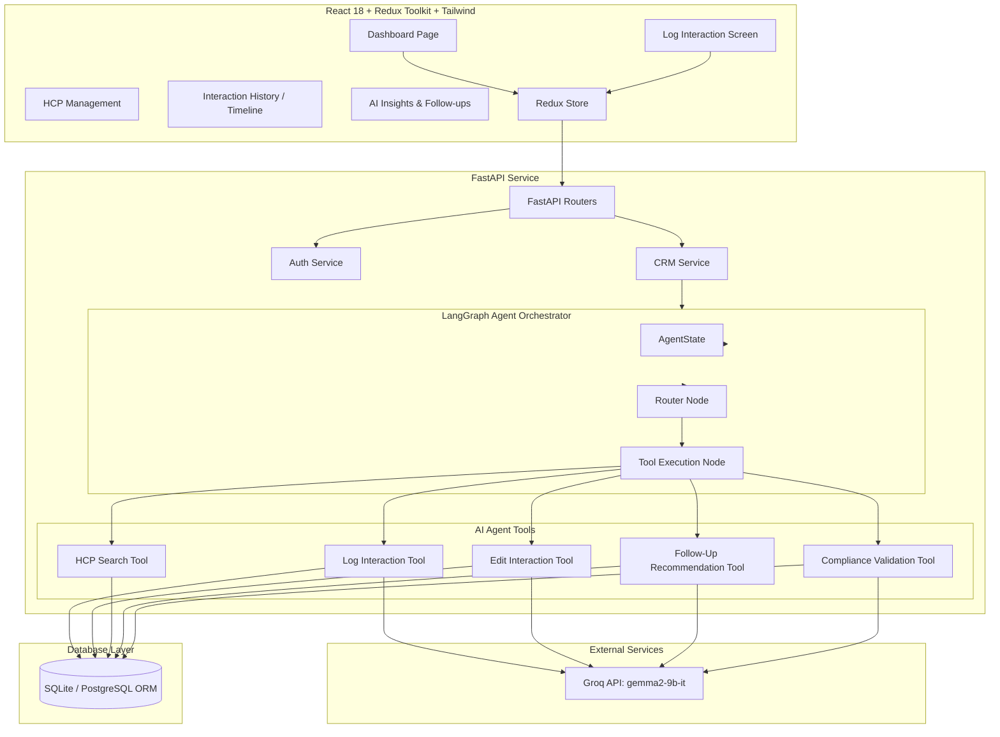

# AI-First CRM HCP Module

An enterprise-grade, production-ready AI-First CRM module tailored for Healthcare Professionals (HCPs) and specialty pharmaceutical field representatives. The application features a dynamic NLU-driven **Log Interaction Screen**, compliance audit shield, interactive clinic dashboards, real-time follow-up tasks, and audit trail timelines.

---

## 🏗️ Architecture Overview

The system is built as a decoupled modern full-stack web application:



---

## 🌟 Key Features

1. **Analytical Dashboard**: Clinical KPIs, engagement trend graphs, therapeutic category share charts, and quick-action item panels using Recharts.
2. **Double-Engine Log Interaction Screen**:
   - *Structured Form*: Standard inputs for manual structured fields.
   - *AI detaiLogger (Conversational NLU)*: Natural language inputs parsed into structured CRM logs, sentiment scores, follow-up events, and compliance scans.
3. **PhRMA Compliance Validation Shield**: Scans notes dynamically for bribes, off-label assertions, or personal benefit promises using LLM-based medical audits.
4. **Interaction Timeline Cockpit**: Vertical audit trail of interactions detailing original logs vs. AI summaries, with inline dynamic edit forms that regenerate schedules.
5. **Dynamic Follow-Up Scheduler**: Smart planner board indicating doctor follow-up items with priority levels and one-click completion.
6. **Zero-Configuration Fallback Engine**: Seamless high-fidelity local NLU simulation runs instantly if `GROQ_API_KEY` is not present, allowing review without a key.

---

## 🚀 Quick Start (Local Setup)

### Prerequisites
- Python 3.10+
- Node.js 18+

### 1. Database & Backend Configuration

1. **Create Virtual Environment**:
   ```bash
   cd backend
   python -m venv venv
   # On Windows:
   .\venv\Scripts\activate
   # On macOS/Linux:
   source venv/bin/activate
   ```

2. **Install Dependencies**:
   ```bash
   pip install -r requirements.txt
   ```

3. **Configure Environment (`.env`)**:
   Create a `.env` file in the `backend/` directory:
   ```env
   DATABASE_URL=sqlite:///./crm.db
   SECRET_KEY=supersecretkey_crm_hcp_module_109238!@#
   GROQ_API_KEY=your_optional_groq_api_key
   ENVIRONMENT=development
   ```

4. **Seed the Database**:
   ```bash
   python seed.py
   ```
   *Note: This creates mock clinicians (Dr. Sarah Jenkins, Dr. Amit Sharma, etc.), products (Cardiox, GlycaCare), and default users.*

5. **Start FastAPI Server**:
   ```bash
   python -m uvicorn app.main:app --reload --port 8000
   ```

---

### 2. Frontend Configuration

1. **Install Packages**:
   ```bash
   cd frontend
   npm install
   ```

2. **Start Dev Server**:
   ```bash
   npm run dev
   ```
   *The application will boot at [http://localhost:3000](http://localhost:3000).*

---

## 🐳 Running with Docker Compose (Single Command)

To run the entire multi-container CRM stack with a single command, execute the following from the root workspace:

```bash
docker-compose up --build
```

- **Frontend**: Accessible at [http://localhost:3000](http://localhost:3000)
- **Backend API**: Accessible at [http://localhost:8000](http://localhost:8000) (Swagger Docs at [http://localhost:8000/docs](http://localhost:8000/docs))

---

## 🔐 Credentials & Quick Authentication
For instant evaluation, the frontend has an **Auto-login Facilitator** active. On initial load, it silently authenticates the default sales representative:
- **Username**: `salesrep`
- **Password**: `password123`

---

## 📋 REST API Endpoints Specification

### 1. Authentication
*   `POST /api/v1/auth/register`: Create a new user (Representative, Manager, Admin).
*   `POST /api/v1/auth/login`: Authenticate and receive a JWT.

### 2. Healthcare Professionals (HCPs)
*   `GET /api/v1/hcps`: List all clinicians (filterable by specialty, city, priority).
*   `POST /api/v1/hcps`: Add a new physician profile.

### 3. Interactions & Agent Orchestration
*   `POST /api/v1/log-interaction`: Log a new interaction (supports manual JSON fields or NLU string text).
*   `PUT /api/v1/edit-interaction/{id}`: Correct interaction details, triggering LangGraph database revisions.
*   `GET /api/v1/interactions`: Fetch all logged interactions.
*   `GET /api/v1/hcp-history/{hcp_id}`: Fetch full interaction trail for a specific clinician.

### 4. Smart Insights
*   `POST /api/v1/ai-chat`: Converse with the CRM assistant (preserves conversational context).
*   `GET /api/v1/followups`: Fetch list of planned clinical follow-ups.
*   `GET /api/v1/dashboard-metrics`: Retrieve analytic aggregates (specialties, sentiments, trends).

---

## 🛡️ NLU Simulation Engine Details
If `GROQ_API_KEY` is not defined, the service activates `simulate_groq_response` inside `groq_service.py` to analyze doctor names, specialties, and hospital names. It will even correctly detect:
- **Compliance Violations**: Test writing *"Offered Dr. Jenkins a free luxury cruise trip"* to watch the validation shield flag the action in real-time.
- **Follow-up recommendation**: Tailors scheduled clinical tasks according to the therapeutic product mentioned.
